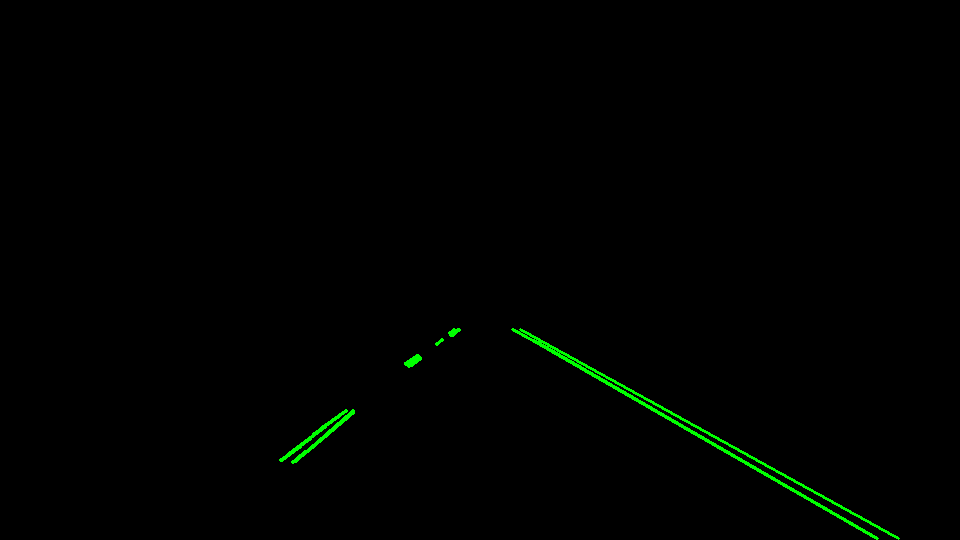

### My journey to finding lines

### This is the submission of my first project for the Self-Driving Car Nanodegree.

The files of interest are:

1. P1.ipynb

2. WRITEUP.md

3. /writeup_output/

The code can be run directly from the IPython notebook, P1.ipynb.
The only items that may need to be changed are the hough = 1 and regression = 1. These turn on or off the overlays of each. 

All images for the write-up are contained in the writeup_output folder.

Thanks for giving me a new passion!

This project consisted of applying techiques learned in class to find lane line from dashcam video. The pipeline consisted of the following macro steps.

1. Grayscale or color mask image.

2. Gaussian smoothing.

3. Canny edge detection.

4. Lane region of interest masking.

5. Hough line detection.

6. Hough line averaging and lane annotation.

### 1. The pipeline

At first when I sat down to start this project I had a good idea of what I wanted to do. I had high hopes; I was going to fit a cubic polynomial to the data and show curved lines. My hopes were quickly dashed. I couldn't figure out how to turn Hough line data into a useable cubic polynomial. I switched gears and stuck to the instructions and instead fit a line to the Hough lines.

That was much easier to manage and kept me on track for on time submission. So here are the steps I took for the initial images.

I started with simply gray scaling the images.

Then is used the Gaussian smoothing to soften the noise.

The next step was to feed the smoothed image into Canny edge detection. 

That looks really neat! I was surprised at the detail.

Lets get rid of that detail even though it looked cool! I used a trapezoid
mask as in class.

The last step is to feed that into a Hough lines detection.

Wow! those lines look really sharp!

Now it may seem from my description that it was easy, but in fact it took me hours to tune the variable in the Hough lines function. I wanted nice contiuous lines without overfitting. I thought, it doesn't get better than this. Then I tried the challenge video. Ahhhh! Look at all those lines going across my lane! Yuck!

Okay time to reach into the bag of tricks and try something new. I decided
since I had only used grayscale up to this point, maybe I should try some 
color masking to only focus on the colors of interest.

Oooo, that looks nicer already!

So do the Canny edges masked or unmasked.

How about the Houghs? Still pretty good, maybe a little loss of data.

But that leads to a passable result on the challenge video. 

You can see that there is still noise and picking up stray edges but it stays in line with the lane line.

Now to satisfy the "averaging" requirement I chose a linear regression fit from sklearn. On the first videos the regression worked pretty well, although jittery and erratic at times. Occasionally the tips of the lines would jump to the other lane. I determined that was due to the way I was segregating the data into left line and right line. I used the slope of the Hough lines to determine where the far points of the line would be and sometimes the slope put the point on the wrong line. 

So I changed strategies. I segregated the data by splitting the screen roughly in half. Any x-value below a certain value goes left, above goes right. That worked wonders! Now for the excessive jitter.

I decided to average the previous slope with the new slope and heavily weight (to the fifth power) the number of Hough lines in each iteration. That way if a small number of Hough lines have a wacky slope they would not affect the average as much as the previous majority. That smoothed things out quite a bit but still not perfect. The last challenge I had to overcome was in the challenge video. I loose the left lane in the shadowed area and that threw the regression into chaos. The slope would drop to zero. So I implemented a resting home position for the lines if they ever lost sight of the line. This way if one line is visible at least, then the algorithm still keeps reasonable lane bounds until it can reacquire the lost line. 

Ultimately this is where I stopped tuning and tweaking (3 days at 10 hours/day was enough for me and my wife :-p). Although there is still much to be improved I was very satisfied with my success on the challenge video.

###2. Here are the shortcomings

One has already been mentioned in the challenge video. I lost sight of the left line when going into the shadows and just prior. The color masking I did must have masked the yellow line out when it got darker.

Another issue I had was getting rid of all the jitter. 

I also didn’t like that I had to hard code in the trapezoidal masking. I made the vertices of the trapezoid based on image size percentages, so they scaled fairly nicely but still had to tweak them for different videos.

Lastly, I would have liked to fit a cubic polynomial to the lane lines rather then a straight line. 

###3. Things I would love to improve

I would like to tune the color filtering and masking to isolate the whites and yellows better.

I would definitely work on stabilizing the jitter from the over active regression fitting. I believe a different moving average scheme with weighting on line length rather than number of lines would work better. As well as expanding the number of slopes in the moving average from just the previous to maybe the last ten slopes.

I also would find a better more robust way to segregate the data into left and right. Currently, if the road bends to abruptly, I would get crossover.

It would also be great to do a higher order polynomial fit to the lines so that there is more of a predictive nature to the lane detection. Rather than waiting until the lane gets so close that response time becomes an issue.

Lastly determining a masking technique that is entirely independent of video or camera location.

### Thank you creators for making a wonderful project and opening my eyes to this wonderful world!
I think I have truly found a passion in self-driving cars and hope to change my career as soon as possible. This stuff is really fun!
